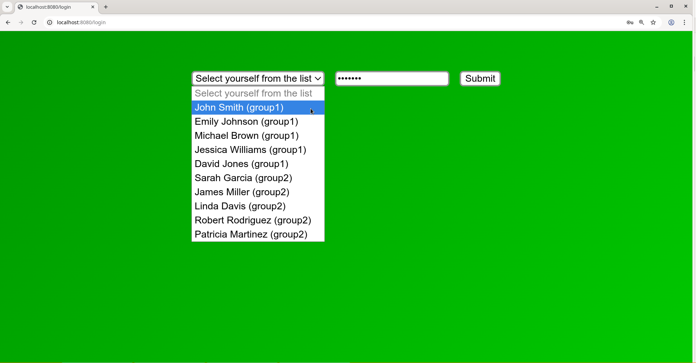
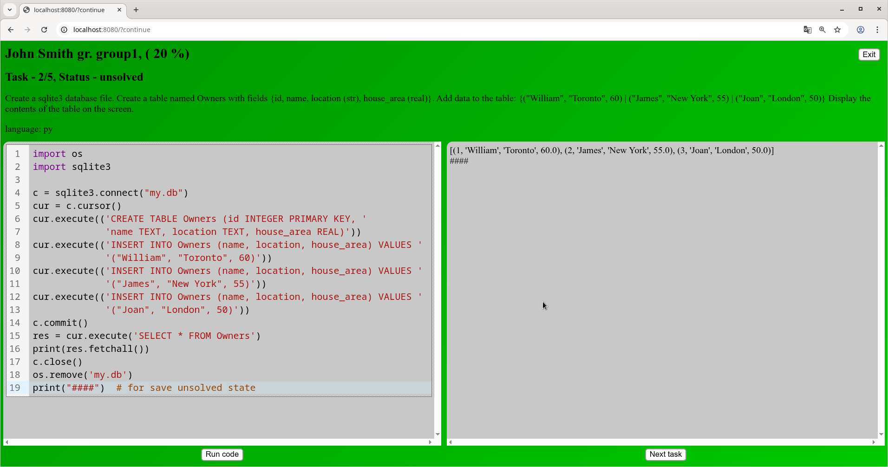
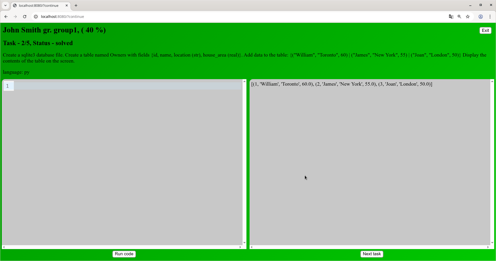
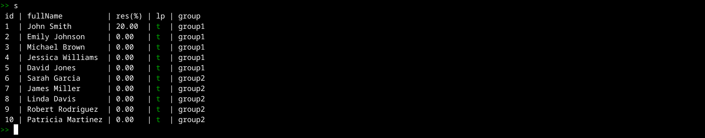

# skills-testing-system

## About the system

A lightweight automated programming skills testing system designed for use within a local classroom
network. The system consists of three main components:
 1. a bash script for building a test,
 2. a bash script for interactive management of the testing process,
 3. a web application for conducting the testing.

## Screenshots
*Login page*

*Test page with an unsolved task*

*Test page with the solved task*

*Output of students' results*


## Supported programming languages

Currently supported:
 * Python,
 * Bash.
 
## Installation

For Debian/Ubuntu run:
```bash
git clone https://github.com/rudkovskiiK/skills-testing-system.git
sudo apt update && sudo apt upgrade
sudo apt install openjdk-17-jdk # 17 or later
sudo apt install sqlite3 sed python3 bubblewrap python3-pip iproute2 npm maven rlwrap
cd skills-testing-system
./build.sh
echo alias gentest=\"$(pwd)/src/main/bash/gentest.sh\" >> ~/.bashrc
echo export STS_SERVER_PATH=\"$(pwd)/target/skills-testing-system-1.0.0.jar\" >> ~/.bashrc
echo alias runtest=\"rlwrap $(pwd)/src/main/bash/runtest.sh\" >> ~/.bashrc
```
After executing the commands, restart your terminal emulator session.

## Usage model

Create two directories on your computer:
* a tasks directory (e.g., 'tasks/'),
* a students directory (e.g., 'students/').

### Tasks directory

The tasks directory contains files with code in Python and/or Bash, and optionally a 'data/' directory
where various files and directories required for completing tasks by students can be stored. During test
assembly, files and directories from 'data/' will be copied to the test directory and will become
available to students while they write code in the browser (in read‑only mode)

Example task file:
```python
# :d: Print the sum of numbers
# :d: a and b. Number a = 3, b = 9.
# :level: L
# :class: A

print(a + b)
```

Comments marked with :d: allow composing the task description. There is no limit on the number of such
comment lines. During test assembly, text from these comments will be extracted and concatenated.

The comment marked with :level: may contain the following values: L, M, or H. L stands for low, M for
medium, and H for high difficulty level of the task.

The :class: comment may contain a sequence of any letters, digits, or underscores. It allows the test
builder to exclude tasks of the same class and difficulty level from a student's set. Tasks of different
difficulty levels may share the same class designations.

Following the comments described above is the reference code of the task. During test assembly, each
task file will be executed, and its standard output, after stripping spaces, tabs, and newline
characters, will be passed to a hash function. During testing, matching the hash of the student's
program output with the reference hash is the condition for marking the task as "solved".

### Students directory

The students directory contains CSV files describing student groups. Each file must conform to the
following pattern: groupName_nLkMcH.csv, where the parameters L (low), M (middle), H (high) denote task
difficulty levels, and n, k, c are the numbers of tasks of the corresponding difficulty level. The
content structure of a student file should contain lines of the form:
```
full_student_name,student_password,nLkMcH
```

The last parameter is optional and allows overriding the complexity of the test set for a specific
student.

### Building a test

A test is built by executing the following command in the command line:
```bash
gentest test_name group_directory task_directory
```
The test_name parameter specifies the name of the test. If the build completes successfully, a directory
named 'test_name/' is created, containing files and directories required for conducting the test. If the
test includes Python tasks, a Python virtual environment must be created and activated beforehand, with
the necessary libraries installed. During the test build, a separate Python virtual environment is
created inside the 'test_name/' directory, intended for executing student Python code inside the
bubblewrap sandbox. Dependencies identical to those in the active environment are installed into it.
After the test is created, the previously activated Python environment may be deactivated.

### Test configuration files

The file 'test_name/settings/server.txt' contains the web server port number:
```
port:8080
```

The file 'test_name/settings/resource_limits.txt' sets resource limits for student tasks. The file
contains the following default options:
```
timeout:10 – maximum execution time of a student task in seconds,
nice:5 – priority of the process executing the student task (higher number means lower priority),
MemoryHigh:800M – soft memory usage limit for the student task,
MemoryMax:1000M – hard memory usage limit for the student task,
MemorySwapMax:0 – maximum swap size for the student task process,
RunTasksMax:5 – maximum number of student tasks the server runs simultaneously (others are queued),
StudProcMax:100 – maximum possible number of processes and threads spawned by the student task.
```
If no unit is specified for MemoryHigh, MemoryMax, MemorySwapMax, the memory limit is assumed to be in
bytes. The following suffixes are allowed: K, M, G, T. If memory size is unlimited, specify the value
*infinity*. For MemoryHigh and MemoryMax, the memory limit may also be specified as a percentage of
physically available RAM.

There is also a hard limit of 2048 KiB on the size of the text output of a student's task.

### Testing process

At the beginning of testing, connect your computer to the local area network of the computer classroom.
Next, execute the following command in the command line:
```bash
runtest 'test_name'
```
After a series of test validity checks, you will enter an interactive mode where you can view the list
of students, their current results, and login permissions (commands: s, sg), start and stop the testing
web server (commands: start, stop), install additional Python packages into the sandbox virtual
environment (command inst), and view student code (commands: st, stc). A complete description of
commands and their parameters is provided below.
```
g - print list of all student groups
s - print list of all students
s csv - print list of all students in csv format
sg <group_id> - print a list of all students in the group
sg <group_id> csv - print a list of all students in the group in csv format
lp t|f - set the login permission flag for all students
lps <student_id> t|f - set the login permission flag for student
lpg <group_id> t|f - set the login permission flag for all students in the group
st <student_id> - show student task id's
stc <student_id> <task_id> - show the description and code of the student's solution to the task
start - web server start
stop - web server stop
log - print server log
inst <python_package_name> - install python package into virtual environment inside sandbox
ip - show IP addresses of host network interfaces
q - exit
h - print this help
```
When the runtest script receives signals: SIGTERM, SIGINT, SIGQUIT or the 'q' command is executed, the
web server process is automatically stopped if it was running.

## Security recommendations

Although the web server runs student code inside the "bubblewrap" sandbox, which in turn runs under
systemd control, we strongly recommend conducting student testing under a dedicated user account to
enhance security.

## Additional features

Each student has a home directory within 'test_name/work-tmp/stud-home/', which is mounted into the
sandbox with write permissions. The student may save various files there, though no single file can
exceed 2048 KiB under any circumstances. In addition, any images saved in PNG or JPEG format will be
displayed in the student's browser alongside the textual output of their code execution. Before each
new run of the student's task, their home directory is completely cleared.

To speed up system performance and reduce solid‑state drive wear, the 'test_name/work-tmp/' directory
may be mounted in RAM before testing using the following command:
```bash
mount -t tmpfs tmpfs -o size=1000M test_name/work-tmp
```
## Web application specifics

* A student logs into the testing system using their password, the instructor's IP address, and the web
server port. Each student may have only one session. If a student logs in from a second computer, the
first session is automatically terminated.
* After a student successfully solves a task, the task code disappears from the student's browser.
* The 'Next task' button on the test page in the browser cycles through tasks in a circular manner.
